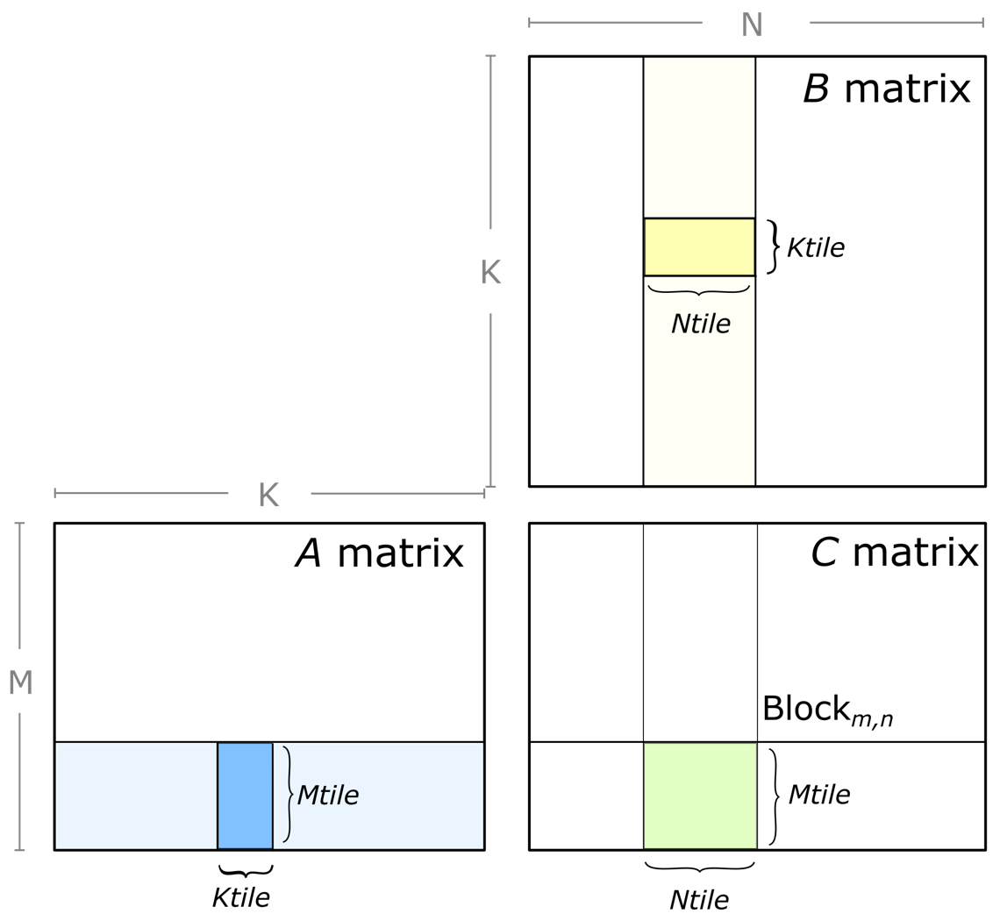
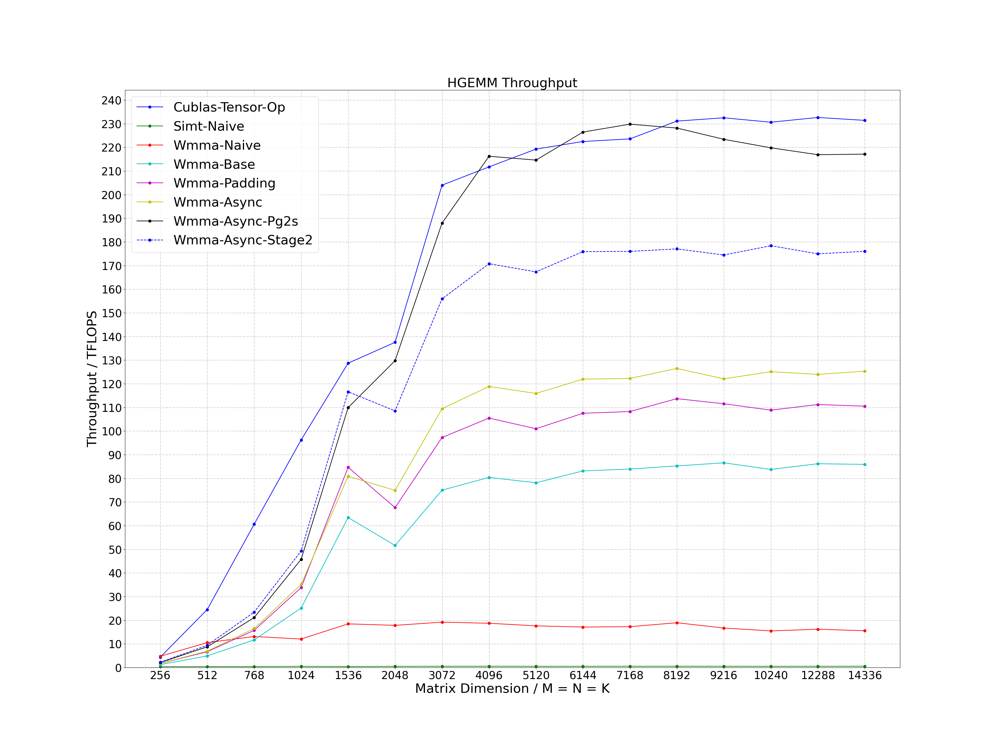
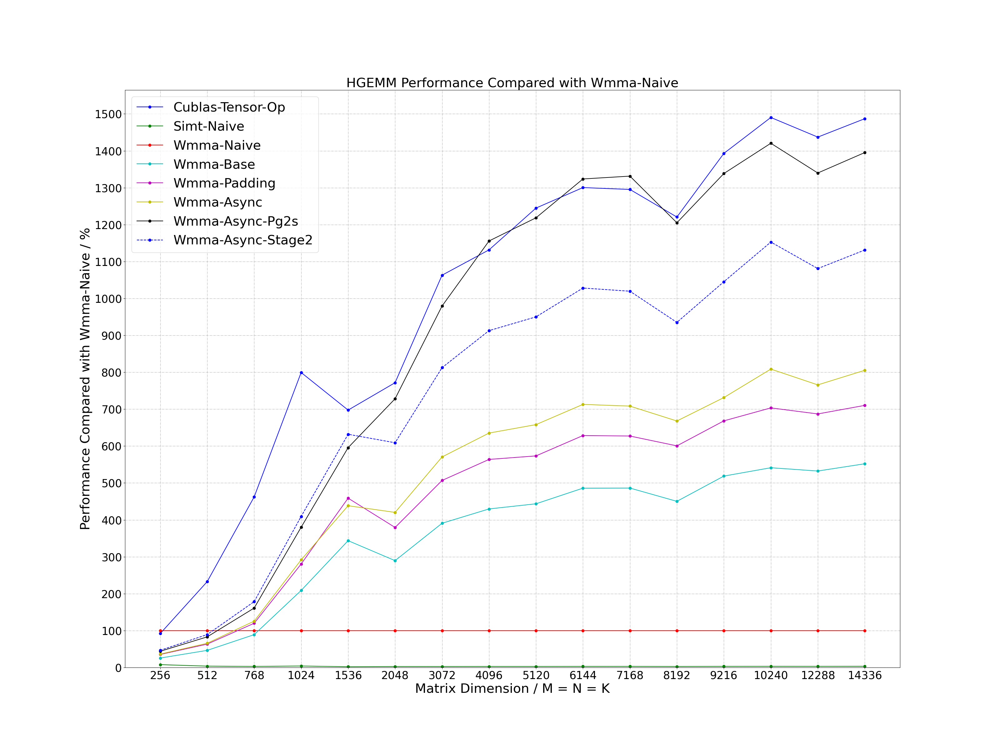
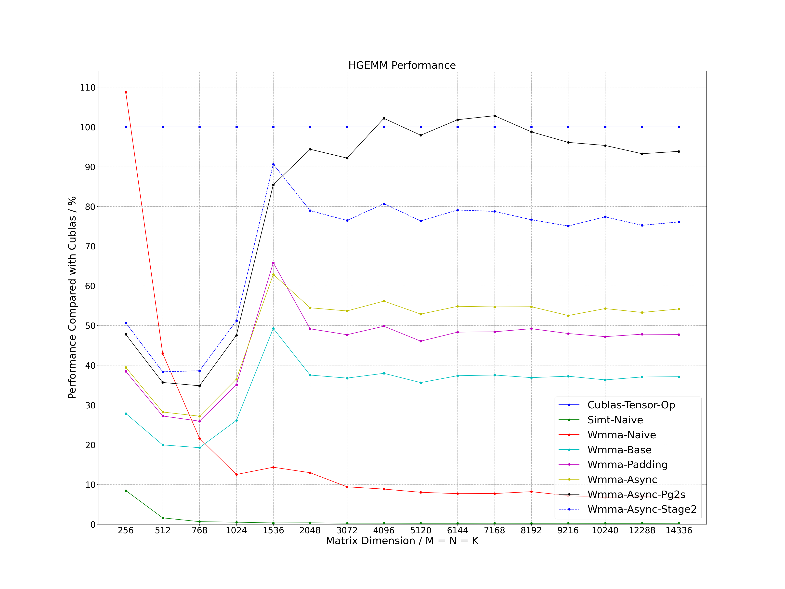

This is for the course project _Tensor Core Accelerated Skinning_ for Highly Parallel Programming of GPUs of TU Dresden. The purpose of the project is to find out and try
ways to profil tensor throughput for SMPL — A Skinned Multi-Person Linear Model.  
Check https://github.com/FEARBEFORETHEMARCHOFFLAMES/WMMATensor.git for the other part of the implementation.
# CUDA HGEMM
Several optimization methods of half-precision general matrix multiplication (HGEMM) using tensor core with WMMA API and MMA PTX instruction. The calculation expression is as follows, where the precision of matrix A (M * K), B (K * N) and C (M * N) is FP16. Through exploring various matrix tiling and optimization methods, the current performance between 256 to 16384 dimensions is not less than 95% of the performance of cublas, and in many scenarios, it exceeds the performance of cublas.
```
C (M * N) = A (M * K) * B (K * N)
```



# Optimization Method
- Tiling: 256 * 128 for block tiling size and 64 * 64 for warp tiling size
- Coalescing Access: using wide instruction access to global memory
- Data Reuse: using shared memory to reuse data of matrix A and B
- Async Copy: using asynchronous copy operation with non-blocking instruction
- Bank Conflict: using padding method for WMMA API and permuted method for MMA PTX instruction to eliminate bank conflict
- L2 Cache: using swizzle access mode to increase L2 cache hit ratio
- Register Reuse: calculating as "Right Left Right Left" for the internal tile of warp

# Compile
## Environment
- OS: Linux
- Cmake Version: >= 3.12
- GCC Version: >= 4.8
- CUDA Version: >= 11.0
- Others: gflags, ccache
```
sudo apt-get install libgflags-dev ccache
```

## Clone
```
git clone https://github.com/HumbabaZ/cuda_hgemm_WMMA.git
```

## Build
### NVIDIA A100
```
cd cuda_hgemm
./build.sh -a 80 -t Release -b OFF
./build.sh -a 80 -t Debug -b OFF
```

### RTX3080Ti / RTX3090 / RTX A6000
```
cd cuda_hgemm
./build.sh -a 86 -t Release -b OFF
./build.sh -a 86 -t Debug -b OFF
```

# Run Sample
```
./run_sample.sh
```

# Performance
Process the data in the log and plot it as a line chart.

```
cd tools/performance
./performance.sh
```

## A100




